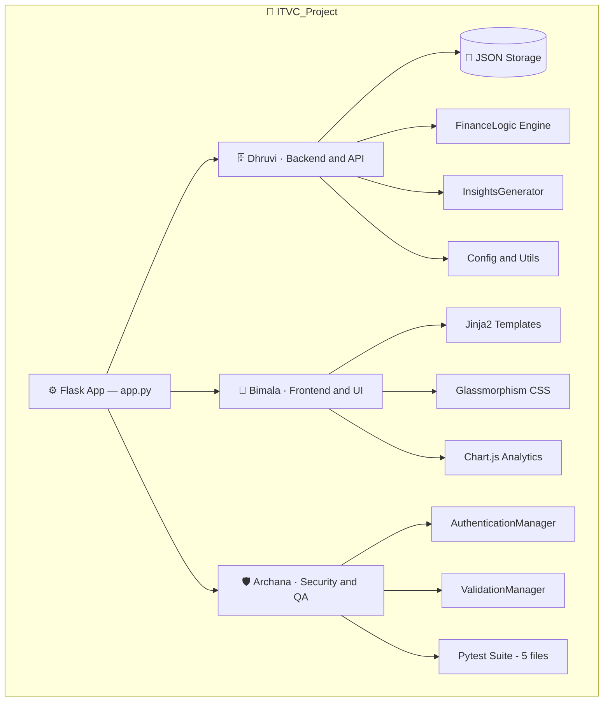

# 💸 Smart Expense Tracker

<div align="center">

<!-- HERO — pitch black → deep indigo → royal violet → vivid purple → orchid → neon lilac -->


<a href="https://git.io/typing-svg">
  
</a>

<br/><br/>

<a href="#"></a>
<a href="#"></a>
<a href="#"></a>
<a href="#"></a>
<a href="#"></a>
<a href="#"></a>
<a href="#"></a>

<br/><br/>


<br/><br/>


<br/>

*A full-stack personal finance dashboard — deep-space glassmorphism UI, algorithmic spend analysis,*
*real-time Chart.js visualizations, and session-based auth. Zero config. Just clone and run.*

<br/>

[](https://github.com)&nbsp;
[](https://github.com)&nbsp;
[](https://github.com)&nbsp;
[](https://github.com)&nbsp;
[](https://github.com)&nbsp;
[](https://github.com)

<br/>


</div>

<br/>

<!-- ================================================================== -->
<!--  ✦  ABOUT                                                           -->
<!-- ================================================================== -->

<div align="center">

<!-- ABOUT — near-black → deep plum → royal violet → bright violet → soft orchid → pale neon -->


</div>

<br/>

<table align="center" width="94%">
<tr>
<td width="25%" align="center" valign="top">
<br/>

<br/><br/>
<b>🏛️ Modular Architecture</b>
<br/><br/>
<sub>Three clean domains — Backend, Frontend, and Security — each confined to its own directory with zero cross-coupling.</sub>
<br/><br/>
</td>
<td width="25%" align="center" valign="top">
<br/>

<br/><br/>
<b>🎨 Premium Dark UI</b>
<br/><br/>
<sub>Deep-space dark theme, animated floating orbs, rotating conic mesh, twinkling starfield, and neon glassmorphism cards.</sub>
<br/><br/>
</td>
<td width="25%" align="center" valign="top">
<br/>

<br/><br/>
<b>⚡ Lightweight Stack</b>
<br/><br/>
<sub>Flask + vanilla JS + CSS3. No React, no SQL server, no infra setup. Clone → install → run in two minutes flat.</sub>
<br/><br/>
</td>
<td width="25%" align="center" valign="top">
<br/>

<br/><br/>
<b>🧠 Smart Insights</b>
<br/><br/>
<sub>Algorithmic spend-pattern detection, threshold breach alerts, and category anomaly surfacing — all in real time.</sub>
<br/><br/>
</td>
</tr>
</table>

<br/>

<!-- ================================================================== -->
<!--  ✦  FEATURES                                                        -->
<!-- ================================================================== -->

<div align="center">

<!-- FEATURES — dark indigo → vivid purple → bright orchid → magenta-purple → pale neon -->


</div>

<br/>

<div align="center">

<table width="94%">
<tr>
<td width="50%" valign="top">

| &nbsp; | Feature | Detail |
|:---:|:---|:---|
| 🔐 | **Authentication** | Session login & register · Werkzeug hashing |
| 📊 | **Live Dashboard** | Income · Expense · Net Balance cards |
| 🧠 | **Smart Insights** | Algorithmic overspend detection & alerts |
| 📈 | **Analytics** | Doughnut + monthly bar chart (Chart.js) |
| 🧾 | **Transaction Log** | Full history · `HIGH/NORMAL/LOW` spend tags |

</td>
<td width="50%" valign="top">

| &nbsp; | Feature | Detail |
|:---:|:---|:---|
| ➕ | **Add Transaction** | Income · Expense · Transfer · categories |
| 🗑️ | **Smart Delete** | One-click · intelligent page redirect |
| 🌌 | **Animated BG** | Orbs · conic mesh · starfield (pure CSS) |
| 📱 | **Responsive** | Mobile-first · sidebar → top nav |
| 🏷️ | **Spend Tags** | Auto-tagged vs your personal average |

</td>
</tr>
</table>

</div>

<br/><br/>

<!-- ================================================================== -->
<!--  ✦  UI SHOWCASE                                                     -->
<!-- ================================================================== -->

<div align="center">

<!-- UI SHOWCASE — midnight → electric indigo → vivid violet → bright orchid → neon lilac -->


<br/><br/>

<br/><br/>

<!-- DASHBOARD — deep navy-purple → royal → vivid → orchid → pale neon -->


<br/><br/>


<br/><br/>


<br/><br/>

<br/><br/>

<!-- ADD TRANSACTION — pitch black → deep plum → violet → bright orchid → lavender -->


<br/><br/>


<br/><br/>


<br/><br/>

<br/><br/>

<!-- ANALYTICS — aubergine → vivid orchid → lavender → pale pink-purple -->


<br/><br/>


<br/><br/>


<br/><br/>

<br/><br/>

<!-- TRANSACTIONS — REVERSED: pale neon → orchid → violet → deep → midnight -->


<br/><br/>


<br/><br/>


<br/><br/>


</div>

<br/><br/>

<!-- ================================================================== -->
<!--  ✦  TEAM ARCHITECTURE                                              -->
<!-- ================================================================== -->

<div align="center">

<!-- TEAM ARCH — deep midnight → royal → vivid → orchid → soft lilac -->


</div>

<br/>

> 🧩 Work is split across **three modular domains** — Backend, Frontend, and Security — each living in its own directory. No domain imports from another; all communication flows exclusively through `app.py`.



<br/>

<div align="center">

| &nbsp; | Member | Domain | Directory | Responsibility |
|:---:|:---:|:---|:---|:---|
| 🗄️ | **Dhruvi** | Backend & API | `dhruvi/backend/` | Flask routes, FinanceLogic, InsightsGenerator, StorageManager, utils |
| 🎨 | **Bimala** | Frontend & UI | `bimala/frontend/` | HTML templates, glassmorphism CSS, Chart.js, responsive layout |
| 🛡️ | **Archana** | Security & QA | `archana/testing_auth/` | Auth, input validation, sanitization, full pytest suite |

</div>

<br/><br/>

<!-- ================================================================== -->
<!--  ✦  PROJECT STRUCTURE                                              -->
<!-- ================================================================== -->

<div align="center">

<!-- PROJECT STRUCTURE — rich plum → vivid orchid → lavender bloom -->


</div>

<br/>

```
💸 ITVC_Project/
│
├── ⚙️  app.py                      ← Flask application factory & all routes
├── 📦  requirements.txt            ← Flask 2.3.2, Werkzeug 2.3.6
├── ✅  verify_setup.py             ← Environment validation script
│
├── 💾  data/
│   ├── expenses.json               ← All user transactions (per-user isolated)
│   └── user.json                   ← Hashed credentials store
│
├── 🗄️  dhruvi/backend/
│   ├── config.py                   ← SECRET_KEY, SESSION_TIMEOUT constants
│   ├── logic.py                    ← FinanceLogic: balance, categories, totals
│   ├── insights.py                 ← InsightsGenerator: pattern detection & alerts
│   ├── storage.py                  ← StorageManager: CRUD on JSON flat files
│   └── utils.py                    ← generate_id(), get_timestamp() helpers
│
├── 🎨  bimala/frontend/
│   ├── dashboard.html              ← Summary cards + Smart Insights panel
│   ├── analytics.html              ← Doughnut + Monthly bar chart page
│   ├── transactions.html           ← Full history with tags + delete
│   ├── add.html                    ← Add income / expense / transfer form
│   ├── login.html                  ← Login & register page
│   ├── style.css                   ← Glassmorphism design system (~2000 lines)
│   └── script.js                   ← Minimal client-side chart helpers
│
└── 🛡️  archana/testing_auth/
    ├── auth.py                     ← AuthenticationManager (hash, verify, session)
    ├── validation.py               ← ValidationManager (amount, sanitize, fields)
    ├── test_app.py                 ← Flask route integration tests
    ├── test_auth.py                ← Authentication unit tests
    ├── test_logic.py               ← FinanceLogic unit tests
    └── test_storage.py             ← StorageManager CRUD unit tests
```

<br/><br/>

<!-- ================================================================== -->
<!--  ✦  QUICK START                                                    -->
<!-- ================================================================== -->

<div align="center">

<!-- QUICK START — dark → indigo → vivid purple → orchid → pale lilac -->


</div>

<br/>

> **Prerequisites:** Python 3.8+

```bash
# ── 1 · Clone ──────────────────────────────────────────────────────
git clone https://github.com/Dhruvi-tech/java-project.git
cd java-project

# ── 2 · Virtual environment ────────────────────────────────────────
python -m venv .venv
source .venv/bin/activate       # macOS / Linux
# .\.venv\Scripts\activate      # Windows

# ── 3 · Install dependencies ───────────────────────────────────────
pip install -r requirements.txt

# ── 4 · Launch 🚀 ──────────────────────────────────────────────────
python app.py
```

<br/>

<div align="center">

🌐 &nbsp; Open **[http://localhost:5000](http://localhost:5000)** in your browser &nbsp; 🌐

<br/>

<table>
<tr>
<th>Field</th>
<th>Default</th>
</tr>
<tr>
<td align="center">👤 Username</td>
<td align="center"><code>admin</code></td>
</tr>
<tr>
<td align="center">🔑 Password</td>
<td align="center"><code>1234</code></td>
</tr>
</table>

<br/>
<sub>💡 Or register a fresh account directly from the login page.</sub>

</div>

<br/><br/>

<!-- ================================================================== -->
<!--  ✦  ROUTES                                                         -->
<!-- ================================================================== -->

<div align="center">

<!-- ROUTES — near-black → electric violet → bright purple → pale neon -->


</div>

<br/>

<div align="center">

| Route | Method | Description |
|:---|:---:|:---|
| `/` | `GET` | Redirects → Dashboard or Login |
| `/login` | `GET` `POST` | Login & new account registration |
| `/logout` | `GET` | Session clear → redirect to login |
| `/dashboard` | `GET` | Summary cards + Smart Insights panel |
| `/analytics` | `GET` | Category doughnut + monthly bar chart |
| `/transactions` | `GET` | Full transaction list with spend tags |
| `/add` | `GET` `POST` | Log income · expense · transfer |
| `/delete/<id>` | `POST` | Delete transaction · smart redirect |

</div>

<br/><br/>

<!-- ================================================================== -->
<!--  ✦  TESTS                                                          -->
<!-- ================================================================== -->

<div align="center">

<!-- TESTS — deep violet → royal → vivid → orchid → neon lilac -->


</div>

<br/>

```bash
# ── Full suite ─────────────────────────────────────────────────────
pytest archana/testing_auth/

# ── Verbose ────────────────────────────────────────────────────────
pytest archana/testing_auth/ -v

# ── Single file ────────────────────────────────────────────────────
pytest archana/testing_auth/test_logic.py -v
```

<br/>

<div align="center">

| 🧪 Test File | ✅ Covers |
|:---|:---|
| `test_auth.py` | Password hashing · session management · login flow |
| `test_validation.py` | Amount validation · input sanitization · field checks |
| `test_logic.py` | FinanceLogic calculations · category totals · balance |
| `test_storage.py` | JSON CRUD — create · read · update · delete |
| `test_app.py` | Flask routes — end-to-end integration |

</div>

<br/><br/>

<!-- ================================================================== -->
<!--  ✦  TECH STACK                                                     -->
<!-- ================================================================== -->

<div align="center">

<!-- TECH STACK — almost black → royal purple → vivid violet → orchid → pale neon -->


<br/><br/>


<br/><br/>

| Layer | Technology |
|:---:|:---|
| 🐍 **Backend** | Python 3.8+ · Flask 2.3.2 · Werkzeug 2.3.6 |
| 🎨 **Frontend** | HTML5 · CSS3 Glassmorphism Design System |
| ⚡ **JS** | Vanilla JavaScript — zero framework overhead |
| 📊 **Charts** | Chart.js (CDN) — doughnut + bar |
| 💾 **Storage** | JSON flat files — no database required |
| 🔐 **Auth** | Flask sessions + Werkzeug password hashing |
| 🧪 **Testing** | pytest — 5 test files |
| 🔤 **Fonts** | Google Fonts — Poppins |

</div>

<br/><br/>

<!-- ================================================================== -->
<!--  ✦  FOOTER                                                         -->
<!-- ================================================================== -->

<div align="center">


<br/><br/>

<!-- FOOTER — full spectrum purple sweep: midnight → deep → royal → vivid → orchid → neon -->


<br/>


&nbsp;

&nbsp;


<br/><br/>

<sub>
  <i>Smart Finance for Everyone &nbsp;·&nbsp; ITVC Project &nbsp;·&nbsp; MIT License</i>
  <br/><br/>
  ⭐ <b>If this project helped you, leave a star!</b> It means a lot to the team.
</sub>

<br/><br/>

</div>
