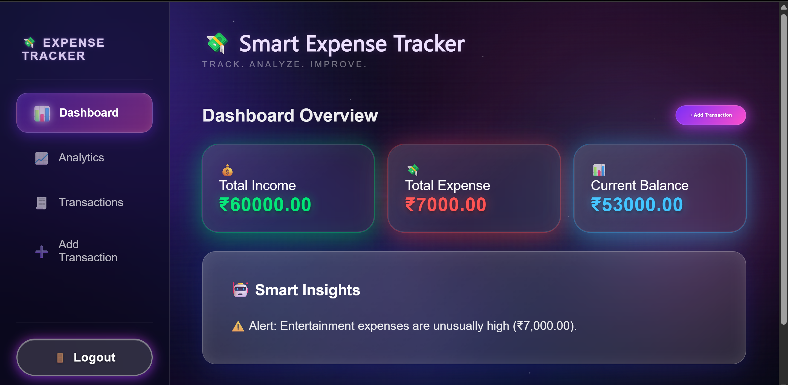
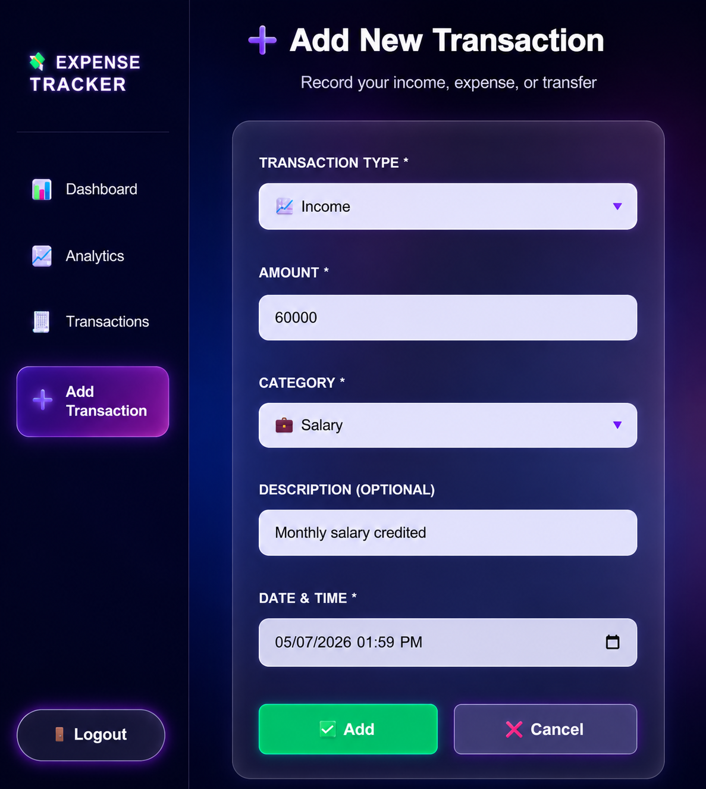
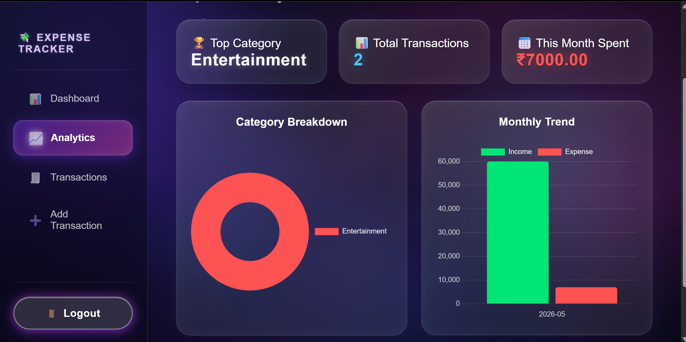
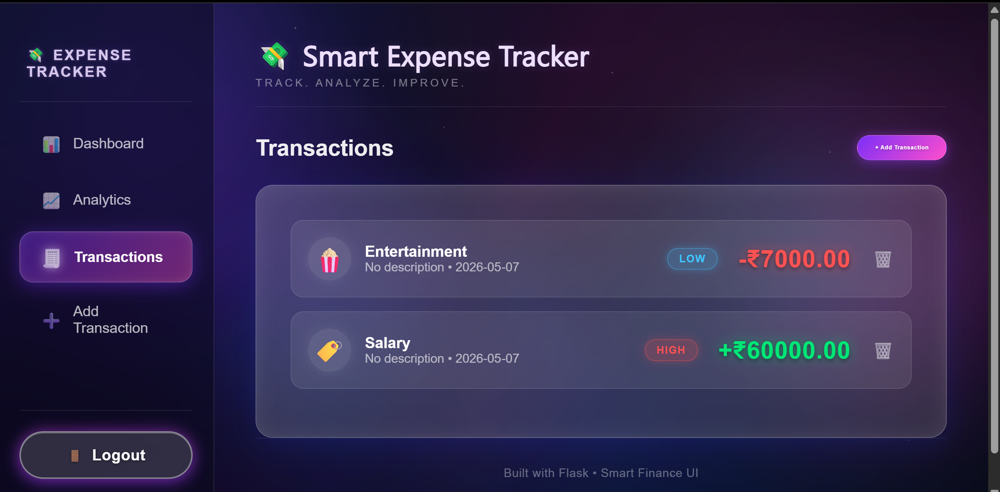
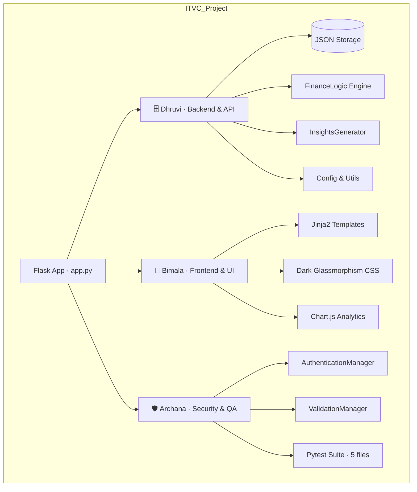

<div align="center">
  
</div>

<div align="center">

  
  
  
  
  
  

  <br/><br/>

  
  
  
  

  <br/><br/>
  <p><b>A full-stack personal finance dashboard with glassmorphism UI, real-time analytics, and intelligent spending insights.</b></p>

</div>

---

## 📖 Project Description

> **Smart Expense Tracker** is a full-stack Flask web application that lets users track income, expenses, and transfers — visualized through a premium dark glassmorphism dashboard with real-time charts and algorithmic financial insights.

- 🏛️ **Modular Architecture** — Strict separation across three domains: Backend Logic (`dhruvi/`), Frontend UI (`bimala/`), and Security & Testing (`archana/`)
- ⚡ **Lightweight Stack** — Flask + vanilla JS + CSS3. No React, no SQL server — zero config to run
- 🎨 **Premium UI** — Deep space dark theme, animated floating orbs, glassmorphism cards, neon glow buttons, Chart.js visualizations
- 💾 **Persistent JSON Storage** — Flat-file data store with per-user transaction isolation
- 🧠 **Smart Insights** — Algorithmic spending threshold analysis with real-time alerts

---
# ✨ Application Screenshots

<div align="center">

### 🌌 Smart Expense Tracker UI Showcase


</div>

<br/>

<div align="center">

## 🏠 Dashboard



</div>

<br/><br/>

<div align="center">

## ➕ Add Transaction



</div>

<br/><br/>

<div align="center">

## 📈 Analytics



</div>

<br/><br/>

<div align="center">

## 🧾 Transactions



</div>

<br/>

<div align="center">


</div>

---

## 👥 Team Architecture

Work is distributed across three modular domains with clean dependency boundaries.



| Member | Domain | Directory | Responsibility |
| :--- | :--- | :--- | :--- |
| **🗄️ Dhruvi** | Backend & API | `dhruvi/backend/` | Flask routes, FinanceLogic engine, InsightsGenerator, StorageManager, config & utilities |
| **🎨 Bimala** | Frontend & UI | `bimala/frontend/` | All HTML templates, glassmorphism CSS, Chart.js integration, responsive layout |
| **🛡️ Archana** | Security & QA | `archana/testing_auth/` | Session-based auth, input validation, sanitization, full pytest test suite |

---

## ✨ Features

| Feature | Detail |
| :--- | :--- |
| 🔐 **Authentication** | Session-based login & registration with bcrypt-compatible password hashing |
| 📊 **Dashboard** | Live summary cards — Total Income, Total Expense, Net Balance |
| 🧠 **Smart Insights** | Algorithmic panel that detects overspending patterns and threshold breaches |
| 📈 **Analytics Page** | Doughnut chart (category breakdown) + Bar chart (monthly income vs expense) |
| 🧾 **Transactions List** | Full history with HIGH / NORMAL / LOW spending tags, category icons, delete |
| ➕ **Add Transaction** | Form with type (income/expense/transfer), category, amount, description, datetime |
| 🗑️ **Delete Transaction** | One-click delete with smart redirect (back to referring page) |
| 🌌 **Animated Background** | Floating neon orbs + rotating conic mesh + twinkling star field (pure CSS) |
| 📱 **Responsive Design** | Mobile-first layout — sidebar collapses to top nav on small screens |
| 🏷️ **Spending Tags** | Each transaction tagged HIGH / NORMAL / LOW vs. user's own average |

---

## 🗂️ Project Structure

```
ITVC_Project/
│
├── app.py                          ← Flask application factory & all routes
├── requirements.txt                ← Flask 2.3.2, Werkzeug 2.3.6
├── verify_setup.py                 ← Environment validation script
├── README.md
├── .gitignore
│
├── data/                           ← Persistent JSON storage
│   ├── expenses.json               ← All user transactions
│   └── user.json                   ← User credentials (hashed)
│
├── dhruvi/                         ← 🗄️ Backend domain
│   └── backend/
│       ├── config.py               ← SECRET_KEY, SESSION_TIMEOUT
│       ├── logic.py                ← FinanceLogic: balance, categories, monthly totals
│       ├── insights.py             ← InsightsGenerator: dashboard/category/monthly insights
│       ├── storage.py              ← StorageManager: CRUD on JSON files
│       ├── utils.py                ← generate_id(), get_timestamp()
│       └── __init__.py
│
├── bimala/                         ← 🎨 Frontend domain
│   └── frontend/
│       ├── dashboard.html          ← Summary cards + Smart Insights panel
│       ├── analytics.html          ← Doughnut chart + Monthly bar chart
│       ├── transactions.html       ← Full transaction list with tags + delete
│       ├── add.html                ← Add transaction form
│       ├── login.html              ← Login & register page
│       ├── style.css               ← Full glassmorphism design system (~2000 lines)
│       └── script.js               ← Minimal client-side helpers
│
└── archana/                        ← 🛡️ Security & QA domain
    └── testing_auth/
        ├── auth.py                 ← AuthenticationManager (hash, verify, validate)
        ├── validation.py           ← ValidationManager (amount, sanitize, input)
        ├── test_app.py             ← Flask route integration tests
        ├── test_auth.py            ← Authentication unit tests
        ├── test_logic.py           ← FinanceLogic unit tests
        ├── test_storage.py         ← StorageManager unit tests
        └── __init__.py
```

---

## 🚀 Quick Start

### Prerequisites
- **Python 3.8+**

### Setup & Run

```bash
# 1. Clone the repository
git clone https://github.com/Dhruvi-tech/java-project.git
cd java-project

# 2. Create & activate virtual environment
python -m venv .venv

# Windows
.\.venv\Scripts\activate
# macOS / Linux
source .venv/bin/activate

# 3. Install dependencies
pip install -r requirements.txt

# 4. Start the server
python app.py
```

### Access
Open **[http://localhost:5000](http://localhost:5000)** in your browser.

### Default Credentials
| Field | Value |
| :--- | :--- |
| Username | `admin` |
| Password | `1234` |

> You can also register a new account from the login page.

---

## 🌐 Application Routes

| Route | Method | Description |
| :--- | :--- | :--- |
| `/` | GET | Redirects to dashboard (if logged in) or login |
| `/login` | GET / POST | Login & register page |
| `/logout` | GET | Clears session, redirects to login |
| `/dashboard` | GET | Summary cards + Smart Insights |
| `/analytics` | GET | Charts — category breakdown & monthly trend |
| `/transactions` | GET | Full transaction history with tags |
| `/add` | GET / POST | Add income / expense / transfer |
| `/delete/<id>` | POST | Delete a transaction by ID |

---

## 🧪 Running Tests

```bash
# Run the full test suite
pytest archana/testing_auth/

# Run with verbose output
pytest archana/testing_auth/ -v

# Run a specific test file
pytest archana/testing_auth/test_logic.py -v
```

Test files cover: authentication, input validation, finance logic, storage operations, and Flask route integration.

---

## 🛠️ Tech Stack

| Layer | Technology |
| :--- | :--- |
| **Backend** | Python 3.8+, Flask 2.3.2, Werkzeug 2.3.6 |
| **Frontend** | HTML5, CSS3 (Glassmorphism), Vanilla JavaScript |
| **Charts** | Chart.js (CDN) |
| **Storage** | JSON flat files (no database required) |
| **Auth** | Flask sessions + Werkzeug password hashing |
| **Testing** | pytest |
| **Fonts** | Google Fonts — Poppins |

---

<br/>

<div align="center">
  
  <br/>
  <b>Built with 💜 · Smart Finance for Everyone</b>
  <br/>
  <sub>ITVC Project · Dhruvi · Bimala · Archana</sub>
</div>
